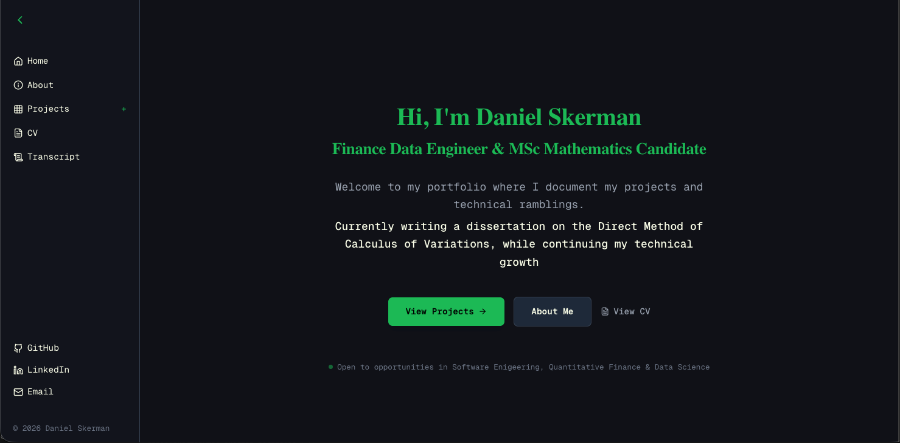
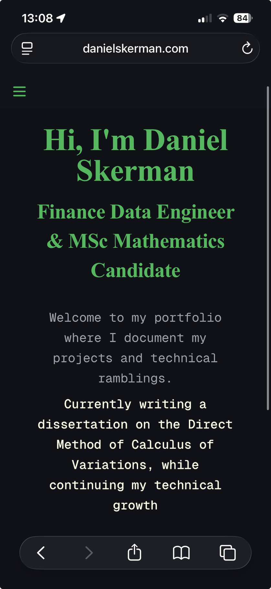

# Skerman Portfolio

This is my personal portfolio website built with [Next.js](https://nextjs.org). It showcases my projects, skills, and experience as a developer with a strong mathematical background.

---

## 🚀 Live Site

The site is currently deployed and hosted on **DigitalOcean**. [See More](https://danielskerman.com)

---

## 🧰 Tech Stack

- Next.js (Pages Router)
- React
- JavaScript / TypeScript
- CSS / Tailwind
- Hosted on DigitalOcean

---

## 📸 Screenshots

### Home Page


### Mobile View


---

## ✨ Features

- Responsive design (mobile + desktop)
- Clean portfolio layout for recruiters
- Projects showcase with links to GitHub / demos
- Fast performance with Next.js optimisations
- Custom UI components and layout

---


## 🏗️ Architecture / Deployment

Simple flow:

User → Domain → Nginx (reverse proxy) → Next.js application → DigitalOcean VPS

### Components

- **Domain**: Routes traffic to the server
- **Nginx**: Reverse proxy and SSL termination
- **Next.js application**: Server-rendered React application (Node.js)
- **DigitalOcean VPS**: Hosting environment

## 🧩 System Diagram

```text
                 ┌────────────────────┐
                 │      Domain        │
                 │(danielskerman.com) │
                 └─────────┬──────────┘
                           │
                           ▼
                 ┌────────────────────┐
                 │       Nginx        │
                 │  Reverse Proxy +   │
                 │   SSL Handling     │
                 └─────────┬──────────┘
                           │
                           ▼
                 ┌────────────────────┐
                 │   Next.js App      │
                 │ (React Frontend +  │
                 │  Server Rendering) │
                 └─────────┬──────────┘
                           │
                           ▼
                 ┌────────────────────┐
                 │ DigitalOcean VPS   │
                 │ (Ubuntu Server)    │
                 └────────────────────┘
```

## 📁 Project Structure

- `/pages` – application routes
- `/components` – reusable UI components
- `/public` – static assets (images, icons, etc.)
- `/styles` – global and component styles

---

## 📌 Notes

This project is actively being improved as part of my portfolio for data engineering roles. Future improvements may include:
- Better SEO optimisation
- Additional project case studies